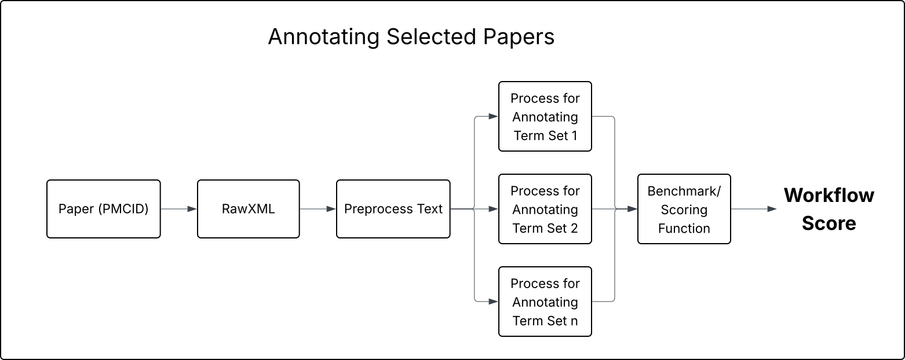

<!-- SPDX-FileCopyrightText: 2025 Stanford University and the project authors (see CONTRIBUTORS.md) -->
<!-- SPDX-License-Identifier: Apache-2.0 -->


# AutoGKB

Goals:
1. Fetch annotated articles from variantAnnotations stored in PharmGKB API
2. Create a general benchmark for an extraction system that can output a score for an extraction system
Given: Article, Ground Truth Variants (Manually extracted and recorded in var_drug_ann.tsv:)
Input: Extracted Variants
Output: Score 
3. System for extracting drug related variants annotations from an article. Associations in which the variant affects a drug dose, response, metabolism, etc.
4. Continously fetch new pharmacogenomic articles

## Description

This repository contains Python scripts for running and building a Pharmacogenomic Agentic system to annotate and label genetic variants based on their phenotypical associations from journal articles. 

## Dependencies
We manage a few repos externally:
 - [PubMed Downloader](https://github.com/shloknatarajan/PubMed-Downloader): This repo is used to download all the markdown files from the PMIDs represented in `var_drug_ann.tsv` 
 - [Huggingface/AutoGKB](https://huggingface.co/datasets/shlokn/autogkb): This converts the annotations and article text into a dataset format for benchmarking

## System Overview


## Downloading the data
```
pixi run gdown —-id 1qtQWvi0x_k5_JofgrfsgkWzlIdb6isr9
unzip autogkb-data.zip

OR

pixi run setup-repo
```
